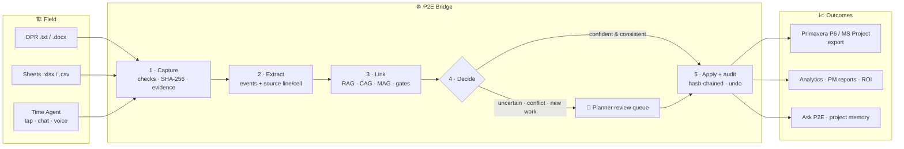
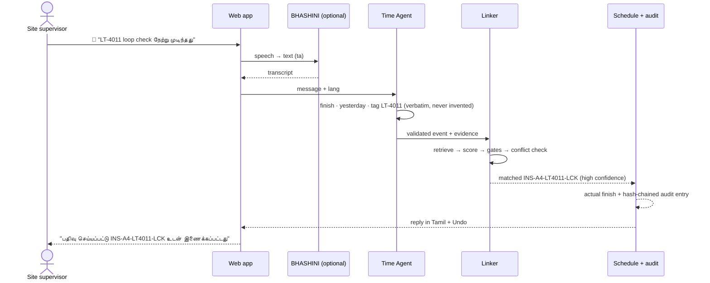
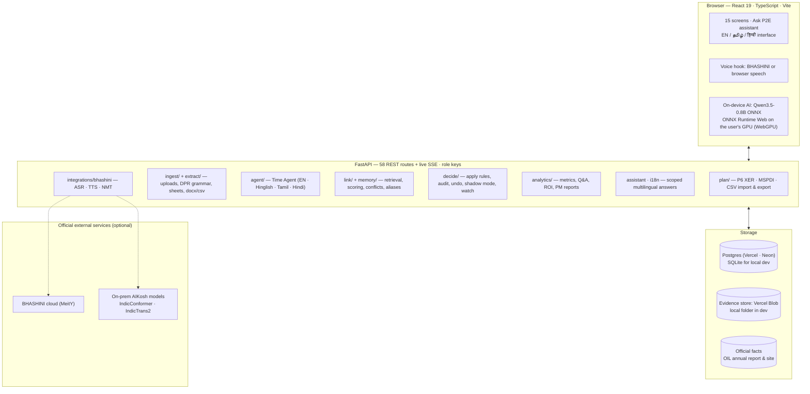
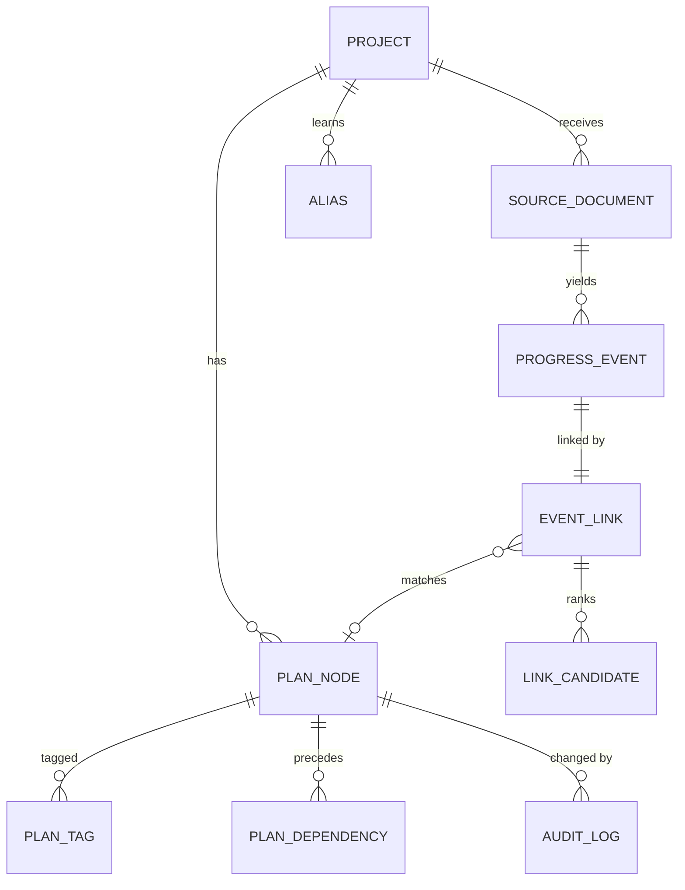
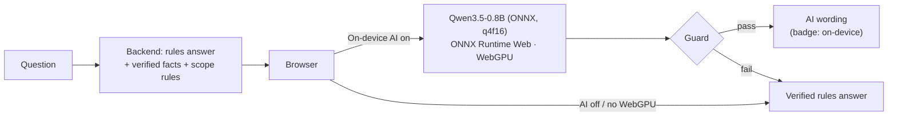

<div align="center">

# P2E Bridge

### Field reports → verified, audited schedule actuals — in seconds, on-premise, at zero AI tokens

**Smart India Hackathon 2026 · Problem Statement SIH26122 · Oil India Limited**


</div>

---

## The problem

On oil and gas construction projects the plan lives in **Primavera P6 / MS Project** (L1 milestones → L5/L6 activities), but reality arrives as **daily progress reports, spreadsheets and phone calls** — free text, Hinglish, abbreviations, relative dates, and **no activity IDs**. Planners reconcile by hand, days or weeks late; schedules drift, delays surface late, and project knowledge is lost at closure.

## The answer

**P2E Bridge** sits between the field and the schedule. It **captures** progress from any channel (DPR upload, discipline sheets, one-tap menu, chat, voice in four languages), **extracts** structured events with line-level evidence, **links** each one to the right L5/L6 activity with a confidence score, lets a **planner decide** anything uncertain, **applies** actual dates with a tamper-evident **audit trail and undo**, and turns the clean history into **analytics, PM reports, ROI and cited project memory**.

> **AI suggests, humans decide, everything is audited — and routine decisions cost zero AI tokens.**

<table>
<tr><td><b>261 / 433</b><br>reports linked automatically</td><td><b>0</b><br>wrong automatic links</td><td><b>48/48 · 31/31</b><br>applied start / finish dates correct</td><td><b>5.3 s</b><br>median upload → schedule</td><td><b>0</b><br>AI tokens</td></tr>
</table>

<sub>All results measured on a realistic **synthetic** project (CGS-EXP-01, 317 activities, 433 labelled field items), not live Oil India data.</sub>

---

## How it works



### One message, end to end



---

## System design



**Design choices that matter**

| Choice | Why |
|---|---|
| Deterministic core (rules + scoring) | Fast, free, explainable; no hallucinated activity matches |
| Optional on-prem LLM, advisory only | Can only pick an existing candidate or NONE; never applies anything |
| On-device AI for wording only | The browser model rephrases the verified answer in the user's language; it never links, decides or writes |
| Evidence for every event | Each event points to the exact report line or sheet cell; originals stored unchanged |
| Append-only, hash-chained audit | Every change is reversible and tampering is detected |
| One pipeline for every channel | A supervisor's tap is validated exactly like a DPR line |
| On-premise, official services only | No project data to external AI; BHASHINI / AIKosh are Government of India resources |

### Data model



---

## Features

| Area | What you get |
|---|---|
| **Capture** | DPR `.txt` / `.docx`, sheets `.xlsx` / `.csv`; **Time Agent** with one-tap *My activities today*, chat and voice; undo; "that one" memory |
| **Languages** | Interface in English, Tamil, Hindi; Time Agent understands English, Hinglish, Tamil script, Tanglish, Hindi script; **Assamese voice via BHASHINI** |
| **Linking** | Tag / alias / attribute retrieval, confidence gates, cross-source date-conflict layer, alias memory that must earn trust |
| **Control** | Planner review queue, approve / choose / mark new / override, hash-chained audit with undo, **shadow-mode pilot** |
| **Schedule I/O** | Import **Primavera P6 XER**, MS Project XML, CSV; export actuals to CSV / MSPDI |
| **Intelligence** | Dashboards, delay causes, productivity, silent-work alerts, daily / weekly **PM reports**, **ROI & efficiency**, cited project Q&A |
| **Ask P2E** | Typed or spoken assistant about the app, the project and Oil India (official sources only); declines everything else |
| **Dashboards** | Progress **S-curve** (planned vs actual, hover read-out), **activity Kanban** by status with late flags, planned-vs-actual and status-by-discipline bars, freshness, delay causes |
| **Admin** | **Access requests** screen: review sign-ups, approve or reject (role keys are still issued by the admin) |
| **Help** | User Guide, Terms of Use (draft), Video Guide — in three languages |

---

## AI design and guard rails

The routine work (extraction, linking, applying dates) is deterministic: **0 AI tokens**. AI is used only to **word answers** in English, Tamil or Hindi, and it can be switched off.



| Guard rail | Where |
|---|---|
| Scope: only this app, this project, Oil India; anything else → `OUT_OF_SCOPE` → polite refusal | system prompt (`p2e/assistant.py`) |
| Facts only: the model sees only the verified facts for this question | backend builds the prompt |
| Every number in the AI answer must exist in the facts, and every number of the verified answer must be kept | `guard()` in `web/src/utils/localAi.ts`, `ai_answer()` on the server |
| Any failure, no WebGPU, or model still downloading → the deterministic answer | browser + server |
| The model never links, decides or writes the schedule | architecture |

**Model.** [`onnx-community/Qwen3.5-0.8B-Text-ONNX`](https://huggingface.co/onnx-community/Qwen3.5-0.8B-Text-ONNX) (base model Qwen/Qwen3.5-0.8B, **Apache-2.0**, 201 languages). About **470 MB**, downloaded once and cached by the browser; it runs on the **user's own GPU** through ONNX Runtime Web (WebGPU), so the server needs no GPU and no AI account. The ONNX Runtime engine is served from this site (`/ort/`); the model comes from Hugging Face, or from your own Vercel Blob store when `VITE_MODEL_HOST` is set (see *Deploy on Vercel*). Measured on a laptop: first answer including the one-time download ≈ 43 s.

Optional server-side model: any OpenAI-compatible endpoint you host (`P2E_LLM_ENDPOINT`, `P2E_LLM_MODEL`; remote hosts refused unless `P2E_LLM_ALLOW_REMOTE=1`) with the same guard rails, per-minute/day budgets and timeout (`p2e/llm.py`).

---

## Built on official resources

| Resource | Use in P2E Bridge | Status |
|---|---|---|
| **BHASHINI** (MeitY) | Speech-to-text, text-to-speech and translation in English, Hindi, Tamil, **Assamese** for the Time Agent and Ask P2E | ✅ Implemented (optional; browser fallback) |
| **AIKosh** (IndiaAI) | IndicConformer + IndicTrans2 models behind an on-premise endpoint — sovereign voice and translation | ✅ Implemented (client mode) |
| **Oil India official sources** | Annual Report 2024-25, Financial Results, Net Zero 2040, CSR pages — every company fact cited; aligned with OIL's **DRIVE** programme | ✅ Implemented (test enforces official domains) |
| **data.gov.in** | PPAC crude-production data for sector context | ⏳ Waiting for the dataset's API |
| **API Setu** | IMD weather to corroborate delay causes; DigiLocker identity | 🗺️ Roadmap |
| DGH NDR · eRTMAC | Subsurface / drilling data | ➖ Not applicable to SIH26122 |

Details and configuration: [docs/OFFICIAL_RESOURCES.md](docs/OFFICIAL_RESOURCES.md)

---

## Results (synthetic project)

| Measure | Result |
|---|---|
| Extraction (433 events, 84 documents) | Precision / recall / F1 **1.000** |
| Automatic links | **261, 0 wrong** · agreement **0.918** (held-out) · top-3 **0.963** |
| Applied dates vs truth | **48/48** starts, **31/31** finishes |
| Cross-source conflicts | 8 of 11 caught, 0 wrong automatic links |
| Project Q&A | **10/10** with citations |
| P6 XER round trip | 317 / 317 activities exact |
| Speed / cost | median **5.3 s** upload → schedule · **0** AI tokens · ₹0 vs ≈ ₹1,933 per 1,000 reports for an LLM-reads-everything approach (assumption) |

---

## Quick start (Windows)

**Fastest:** double-click **`start_demo.bat`** → opens http://localhost:8000 → the cinematic landing page opens → **Sign in** → press **Fill demo credentials** (admin demo account) → set **As of = 2026-09-16**. New users use **Request access**; an admin reviews them under **Admin → Access Requests**. To try the on-device AI, open **Ask P2E** and tick **On-device AI** (Chrome / Edge with WebGPU). The demo account is offered only when `P2E_DEMO_ACCOUNT` is set; production leaves it unset.

First-time setup:
```powershell
python -m venv .venv
.venv\Scripts\python -m pip install -r requirements-dev.txt
.venv\Scripts\python scripts\phase1\init_database.py          # import the synthetic schedule (add --schedule plan.xer for P6)
.venv\Scripts\python scripts\phase2\ingest_documents.py       # extract 84 field documents
.venv\Scripts\python scripts\phase3\link_events.py            # link 433 events
.venv\Scripts\python scripts\phase5\apply_actuals.py --as-of 2026-09-16
cd web; npm install; npm run build; cd ..
$env:P2E_API_KEYS = "planner:<16+ chars>,supervisor:<16+ chars>"
.venv\Scripts\python -m uvicorn p2e.main:app --port 8000
```

Optional — BHASHINI voice & translation (see [docs/OFFICIAL_RESOURCES.md](docs/OFFICIAL_RESOURCES.md)):
```powershell
$env:BHASHINI_USER_ID = "<ULCA user id>"; $env:BHASHINI_ULCA_API_KEY = "<ULCA API key>"
```

Useful scripts: weekly PM report `scripts\phase8\generate_reports.py --period weekly --as-of 2026-09-16` · blind-set evaluation `scripts\phase8\evaluate_blind.py --blind data\blind` · rebuild an old database `scripts\phase1\init_database.py --rebuild`.

## Deploy on Vercel (frontend, backend, database, files)

Everything runs on Vercel: the React build as static files, the FastAPI app as one Python function (`api/index.py`, routed by `vercel.json`), **Postgres** created in the Vercel dashboard (Neon), and uploaded field reports in **Vercel Blob**. The AI runs in each user's browser, so no GPU server is needed.

1. **Import the project.** Vercel → *Add New → Project* → import this GitHub repository. Leave the build settings to `vercel.json`.
2. **Create the database.** In the project: *Storage → Create Database → Neon (Postgres)* → pick a region near your users (e.g. Mumbai / Singapore) → *Connect* it to this project. Vercel adds `DATABASE_URL` to the project's environment variables; the app reads it and uses the psycopg driver.
3. **Create file storage.** *Storage → Create → Blob* → access **Private** → connect it to the project. Vercel adds `BLOB_READ_WRITE_TOKEN`; uploads then go to Blob instead of the read-only function disk.
4. **Set the keys.** *Settings → Environment Variables*: `P2E_API_KEYS = planner:<16+ chars>,supervisor:<16+ chars>,admin:<16+ chars>` (new random keys, never the demo ones). Add `P2E_DEMO_ACCOUNT=admin` only for an evaluator demo.
5. **Load the data once, from your PC.** On the database and Blob pages open the *.env.local* tab, copy the two values, then:
   ```powershell
   $env:DATABASE_URL = "<postgres://… from Vercel>"
   $env:BLOB_READ_WRITE_TOKEN = "<vercel_blob_rw_… from Vercel>"
   .venv\Scripts\python scripts\deploy\copy_to_vercel.py     # data/p2e.db → Postgres, data/uploads → Blob
   ```
   (Tested against a local Postgres: all 10 tables copy, every GET route, the assistant and sign-up work.)
6. **Deploy** (*Deployments → Redeploy*, or push to `main`). Open the site, sign in, check *Overview* and *Ask P2E*.
7. **Optional: serve the AI model from your own Vercel Blob** instead of Hugging Face. Create a second Blob store with **Public** access, then
   ```powershell
   cd web; $env:BLOB_READ_WRITE_TOKEN = "<token of the PUBLIC store>"; node scripts\mirror-model.mjs
   ```
   and add the printed `VITE_MODEL_HOST` as an environment variable, then redeploy.

Live updates use a stream that the server closes after 25 s on Vercel; the browser reconnects automatically. Secrets live only in Vercel environment variables, never in the repository.

### Checks
```powershell
.venv\Scripts\python -m pytest                     # 314 backend tests
.venv\Scripts\python scripts\phase3\evaluate_linking.py
.venv\Scripts\python scripts\phase5\evaluate_apply.py
.venv\Scripts\python scripts\phase6\evaluate_qa.py
cd web; npm test; npm run build                   # 18 frontend tests + type-checked build
```

---

## Project map

```
p2e/                 FastAPI backend
  plan/ ingest/ extract/ agent/ link/ memory/ decide/ analytics/ api/
  assistant.py  i18n.py  integrations/bhashini.py
web/src/             React frontend (pages/, components/, hooks/useSpeech.ts, utils/localAi.ts, i18n.ts)
api/index.py         Vercel entry point (vercel.json routes /api/* here)
data/synthetic/      demo project (schedule, 81 DPRs, 3 sheets, ground truth)
data/company/        Oil India facts — official sources only
data/help/           user guide + terms (EN / TA / HI)
scripts/             pipeline steps, evaluations, reports, deploy/copy_to_vercel.py
tests/               backend tests
docs/                architecture, AI design, plans, presentation pack
```

## Documentation
[Complete product dossier](docs/presentation/P2E_BRIDGE_COMPLETE_DOSSIER.md) · [Full knowledge pack](docs/presentation/P2E_BRIDGE_FULL_PACK.md) · [Official resources](docs/OFFICIAL_RESOURCES.md) · [Upgrade plan](docs/plan/UPGRADE_PLAN.md) · [Phase plan](docs/plan/PHASE_PLAN.md) · [Backend API](docs/architecture/BACKEND_API.md) · [Frontend](docs/architecture/FRONTEND.md) · [Linking layer](docs/ai/LINKING_LAYER.md) · [Time Agent](docs/ai/TIME_AGENT.md) · [Evaluator Q&A](docs/presentation/EVALUATOR_QA.md)

<div align="center"><sub>Built for Smart India Hackathon 2026 · SIH26122 · All demo data is synthetic</sub></div>
