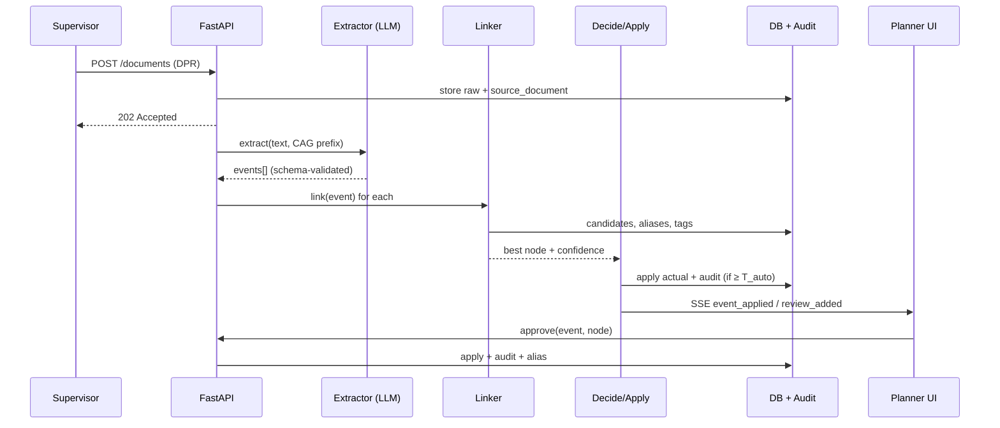

# End-to-End Workflow & Final Demo Flow

[← Master plan](../PROJECT_MASTER_PLAN.md) · Related: [System architecture](../architecture/SYSTEM_ARCHITECTURE.md) · [AI architecture](../ai/AI_AGENT_ARCHITECTURE.md)

## 1. Lifecycle overview

```
 Project setup        Daily execution loop                                    Close-out
 ─────────────        ────────────────────────────────────────────────        ─────────
 Import baseline ─►  Supervisors report (agent / DPR / sheet)                 Build institutional
 (P6/MSP export)      → extract → link → decide                               memory (metrics,
 Load glossary        → auto-apply | review | unmatched                        knowledge entries,
 Assign users         → planner resolves → aliases learned                     OKF bundle)
                      → actuals live in schedule → export to P6/MSP     ─►     Future projects query
                      → dashboard + analytics                                  it in planning
```

## 2. Workflow A: free-text DPR (one report's journey)

**Input** (piping supervisor, uploaded 15-Sep, report dated 14-Sep):
```
DPR – Piping – Area 3 – 14/09
1. Spool 3 & 4 of L-1207 erected, balance 2 spools tmrw
2. HT of 24" line 1203 started 9am, test pack TP-031
3. Pipe rack PR-3 support fabrication done
4. Line 1215 erection hold – material (gaskets) not recd
```

| Step | What happens | Result |
|---|---|---|
| 1 Ingest | Validate .txt, hash, store raw, `source_document(report_date=14-Sep, discipline=piping)` | doc `received` |
| 2 Pre-pass | Tags: `L-1207`, `24"-…-1203`, `TP-031`, `PR-3`, `L-1215`. Quantities: `2 spools`. Date header 14/09 | hints |
| 3 Extract (LLM + CAG prefix) | 4 events: progress (qty 2, L-1207, finer), start (HT 1203, 14-Sep 09:00), finish (PR-3 support fab), hold (L-1215, reason material) | 4 `progress_event` rows, spans verified |
| 4 Link | (1) tag → `PIP-A3-1207-ERC`, granularity finer, 0.91. (2) tag + verb "HT" → `PIP-A3-1203-HT`, 0.97. (3) `PR-3` → two candidates (fabrication vs erection), margin small → LLM adjudicates → fabrication, 0.78. (4) tag → `PIP-A3-1215-ERC`, 0.93 | candidates + confidence |
| 5 Decide (T_auto=0.88, T_review=0.45) | (1) apply: AS for 1207 erection = 14-Sep (first sub-progress), % = 4/6 spools. (2) apply: AS = 14-Sep 09:00. (3) **review** (0.78). (4) apply status `on_hold` + delay reason, no date change | 3 applied, 1 in review |
| 6 Audit + SSE | 3 audit rows with spans. Schedule rows flash. Review badge = 1 | live UI |
| 7 Planner | Opens the review card for (3), sees the span and two candidates, approves fabrication. Alias learned: "pr-3 support fabrication" → node | applied + alias |
| 8 Next day | A similar phrase links via alias at 0.95 → auto-applied | system improved |

## 3. Workflow B: time agent (voice)

```
Supervisor (electrical, Area 2, taps mic): "Cable pulling for MCC-2 feeder finished just now"
Agent  → search_activities("cable pulling MCC-2 feeder", discipline=electrical, area=2)
       → 1 strong candidate ELE-A2-MCC2-CBLPULL (0.93)
Agent: "Mark 'Cable pulling – MCC-2 incomer & feeders (ELE-A2-MCC2-CBLPULL)' FINISHED today 16:40?  [Confirm] [Change]"
Supervisor: "yes"
Agent  → log_event(finish) → decide → applied (source prior high + confirmed by user)
Agent: "Done. Actual finish recorded 16:40. Ref #A-1042. Anything else?"
Supervisor: "termination for the same started"
Agent  → session memory resolves "same" → MCC-2 → candidate ELE-A2-MCC2-TERM → confirm → log
```

Edge paths: ambiguous → 3 chips. Out-of-scope discipline → polite refusal + route to the planner. "Undo" → compensating audit entry.

## 4. Workflow C: discipline spreadsheet

Electrical cable log with headers `Cable No | Frm | To | Len(m) | Pulled? | Dt`:
1. Header row detected. Mapping: `Cable No→tag`, `Len(m)→quantity`, `Pulled?→status`, `Dt→date` (fuzzy). The unknown header `Frm` goes to the LLM once (→ `from_location`). The mapping is cached for this template.
2. 120 rows → 120 events (deterministic). Grouped by plan activity (cables map to "Cable pulling – Area 2 LV" by tag range/area) → sub-progress quantity aggregation.
3. Applies AS = earliest pulled date and % = metres pulled / planned metres. AF only when the planned quantity is reached.
4. Rows with unparseable dates → review with reason. Never dropped.

## 5. Workflow D: unmatched / new activity

DPR: "Temporary drainage trench excavated near pipe rack PR-3 due to waterlogging."
→ No candidate ≥ T_review → **unmatched** queue with suggested parent `Area 3 / Civil` → planner creates `CIV-A3-TMP-DRN` (flagged `is_new`), and the actual is applied. The dashboard counts *unplanned work*, a useful scope-growth signal for OIL.

## 6. Workflow E: institutional memory

PM asks: "How long did 24-inch hydrotests actually take vs plan, and why the slips?"
→ classified as metric + narrative → SQL template over `v_actual_progress` (activity type = hydrotest, size = 24") → median actual 3.5 d vs plan 2 d (n=11) → retrieval over remarks/knowledge → "test-pack documentation holds (6), water availability (3)" → answer with clickable activity citations. At close-out the same insight becomes an OKF entry.

---

## 6.1 Mermaid sequence (DPR path)



---

## 7. Final demo flow (judges, 7–10 minutes)

| # | Time | Show | Say (one line) |
|---|---|---|---|
| 0 | 0:00 | Title + the problem in one slide (fragmented reports → stale schedule) | "Plans are precise, field reports are chaos, and the link between them is a human with Excel." |
| 1 | 0:45 | Schedule screen: synthetic project, 350 L5/L6 activities, actuals mostly empty | "This is the plan OIL already has." |
| 2 | 1:15 | **Upload a messy piping DPR** → processing timeline → schedule rows light up live | "Free text in, activity-level actual dates out, in seconds." |
| 3 | 2:30 | Click an updated row → evidence drawer: source sentence, confidence, audit entry | "Every date is traceable to the exact sentence that justified it." |
| 4 | 3:15 | **Upload the electrical spreadsheet** with odd headers → spool/cable granularity rolled up into % complete | "Different discipline, different format, finer granularity, same result." |
| 5 | 4:15 | **Review queue**: one ambiguous item, one NEW activity. Approve one, create the new one | "Uncertain links go to the planner, and unplanned work gets flagged, never dropped." |
| 6 | 5:15 | **Time agent on a phone, by voice**: log a finish in 2 turns | "Supervisors talk; the schedule updates." |
| 7 | 6:15 | Re-upload a similar phrase → now auto-linked via learned alias | "It learns each site's language from every confirmation." |
| 8 | 6:45 | Metrics slide: auto-apply precision, top-1, coverage, LLM call ratio, ablation | "Measured on labelled data, not claimed." |
| 9 | 7:30 | Dashboard + one memory question with citations | "And when the project closes, this becomes institutional memory." |
| 10 | 8:15 | Architecture slide: on-prem open-weight model, RAG/CAG/MAG roles, production path | "Sovereign by design, ready to scale from a laptop to OIL's data centre." |

**Rehearsal rules:** run the demo in replay mode unless the network is verified. Every click is pre-tested. Have the reset script open. The backup video is cued.

## 8. Judge Q&A prep (likely questions)

| Question | Answer anchor |
|---|---|
| "What if the AI links wrongly?" | Calibrated thresholds (≥95% precision on auto), review queue, undo, audit |
| "Does it need internet / send data out?" | No. Open-weight model, on-prem in production. Demo can run fully offline |
| "Why not just a form?" | Forms are what supervisors avoid. The agent takes ~3 turns, and spreadsheets/DPRs they already write are ingested as-is |
| "How does it handle Primavera?" | Imports MSPDI/CSV now (XER parser stretch). Exports actuals for import. API connector is roadmap |
| "Why these AI techniques?" | RAG for grounded linking, CAG for stable glossary, MAG for learning aliases. Jev evaluated and deferred (sovereignty, maturity) — see the [evaluation](../ai/AI_APPROACHES_EVALUATION.md) |
| "How does it scale?" | Same modules: Postgres+pgvector, queue workers, vLLM ([Deployment §3](../operations/DEPLOYMENT.md#3-production-deployment-target)) |
