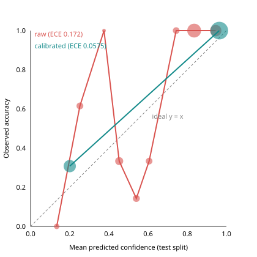

# Linker confidence calibration

Definition: confidence = top-candidate linker score; correct = top candidate is the true L5/L6 activity. Method chosen by 5-fold cross-validation on **dev** (ECE per method: {'identity': 0.1729, 'platt': 0.1019, 'isotonic': 0.0534}) → **isotonic**, fitted on **dev**; **test** used only for the final evaluation. 433 of 433 events have a candidate; planner decisions excluded: none (fresh database: every link is an automatic linker decision, no MAG aliases).

## Before vs after

| Split | Confidence | N | Accuracy | Mean confidence | ECE | MCE | Brier |
|---|---|---|---|---|---|---|---|
| dev (fit) | raw | 213 | 0.6948 | 0.7126 | 0.1574 | 0.4571 | 0.1117 |
| dev (fit) | calibrated | 213 | 0.6948 | 0.6948 | 0.0 | 0.0 | 0.0783 |
| test (held out) | raw | 220 | 0.7955 | 0.7337 | 0.172 | 0.625 | 0.0963 |
| test (held out) | calibrated | 220 | 0.7955 | 0.738 | 0.0575 | 0.1077 | 0.068 |

## Reliability bins - dev

raw (binned by raw confidence):

| Range | N | Mean conf | Accuracy | Gap |
|---|---|---|---|---|
| [0.0, 0.1) | 1 | 0.0845 | 0.0 | 0.0845 |
| [0.1, 0.2) | 6 | 0.1327 | 0.0 | 0.1327 |
| [0.2, 0.3) | 9 | 0.2389 | 0.3333 | 0.0944 |
| [0.4, 0.5) | 31 | 0.4566 | 0.1935 | 0.263 |
| [0.5, 0.6) | 21 | 0.5439 | 0.2381 | 0.3058 |
| [0.6, 0.7) | 7 | 0.6 | 0.1429 | 0.4571 |
| [0.7, 0.8) | 17 | 0.7303 | 1.0 | 0.2697 |
| [0.8, 0.9) | 69 | 0.8327 | 0.9275 | 0.0949 |
| [0.9, 1.0] | 52 | 0.9443 | 1.0 | 0.0557 |

calibrated (binned by calibrated confidence):

| Range | N | Mean conf | Accuracy | Gap |
|---|---|---|---|---|
| [0.2, 0.3) | 75 | 0.2 | 0.2 | 0.0 |
| [0.9, 1.0] | 138 | 0.9638 | 0.9638 | 0.0 |

## Reliability bins - test

raw (binned by raw confidence):

| Range | N | Mean conf | Accuracy | Gap |
|---|---|---|---|---|
| [0.1, 0.2) | 6 | 0.1333 | 0.0 | 0.1333 |
| [0.2, 0.3) | 13 | 0.2519 | 0.6154 | 0.3635 |
| [0.3, 0.4) | 1 | 0.375 | 1.0 | 0.625 |
| [0.4, 0.5) | 21 | 0.4525 | 0.3333 | 0.1192 |
| [0.5, 0.6) | 14 | 0.5401 | 0.1429 | 0.3972 |
| [0.6, 0.7) | 12 | 0.6052 | 0.3333 | 0.2718 |
| [0.7, 0.8) | 12 | 0.7433 | 1.0 | 0.2567 |
| [0.8, 0.9) | 87 | 0.8353 | 1.0 | 0.1647 |
| [0.9, 1.0] | 54 | 0.9454 | 1.0 | 0.0546 |

calibrated (binned by calibrated confidence):

| Range | N | Mean conf | Accuracy | Gap |
|---|---|---|---|---|
| [0.2, 0.3) | 65 | 0.2 | 0.3077 | 0.1077 |
| [0.9, 1.0] | 155 | 0.9636 | 1.0 | 0.0364 |

## By prediction state (test)

| State | N | Raw accuracy | Raw mean conf | Raw ECE | Calibrated mean conf | Calibrated ECE |
|---|---|---|---|---|---|---|
| auto_matched | 142 | 1.0 | 0.8701 | 0.1299 | 0.9658 | 0.0342 |
| conflict_held | 10 | 1.0 | 0.838 | 0.162 | 0.9415 | 0.0585 |
| review | 55 | 0.4182 | 0.427 | 0.2248 | 0.24 | 0.1782 |
| unmatched | 13 | 0.0 | 0.461 | 0.461 | 0.2 | 0.2 |

## Thresholds

Configured (raw score): {'auto_min_score': 0.7, 'auto_min_margin': 0.15, 'lexical_top_k': 10, 'alias_auto_min_confirmations': 2, 'conflict_date_shift_days': 1}. The automatic-link threshold 0.7 maps to calibrated 0.933333. Review and unmatched are decided by rules (object/action gates, margin, novelty, unknown tags, conflicts), not by a score threshold.

| Raw score band (test) | N | Accuracy | Mean raw | Mean calibrated | Auto-matched |
|---|---|---|---|---|---|
| [0.60, 0.70) | 12 | 0.3333 | 0.6052 | 0.3222 | 0 |
| [0.70, 0.80) | 12 | 1.0 | 0.7433 | 0.9333 | 11 |
| [0.80, 1.00) | 141 | 1.0 | 0.8774 | 0.9666 | 131 |

## Calibration map

`[{"raw_up_to": 0.6, "calibrated": 0.2}, {"raw_up_to": 0.8, "calibrated": 0.9333}, {"raw_up_to": 0.8542, "calibrated": 0.9355}, {"raw_up_to": 0.95, "calibrated": 1.0}]`

## Notes

- Dev and test differ in base rate (top-candidate accuracy 0.6948 vs 0.7955; events without a true activity 48 vs 30), so a map fitted on dev is conservative on test.
- The calibrated confidence is an evaluation output; production responses still carry the raw linker score.

